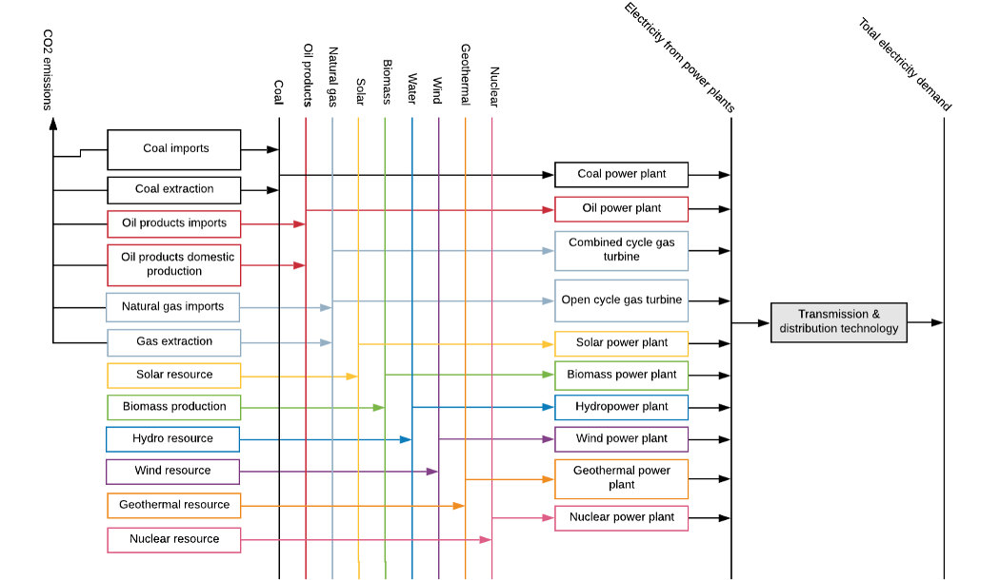

# Learning Objectives

- Understand the overall structure of an energy system
- Explain the difference between a Sankey diagram and a reference energy system

# Lecture Content

An energy system is a system that “comprises all components related to the production, conversion, delivery, and use of energy” as defined in the IPCC Fifth Assessment Report.

::: notes

This system-level view is crucial to define better scenarios, assumptions and the effects of the implementation of a specific policy on the whole energy system.

With the support of projection models, we can forecast future scenarios, simulate the different “what if?” questions and inform policy making based on this evidence.

:::

## The Reference Energy System

The term Reference Energy System (RES) describes an energy system created by the user for modelling exercises.

::: notes

A Reference Energy System has the following characteristics:

- Is a simplified and aggregated graphical representation of the real energy system under analysis;
- Covers not just the present configuration of the energy system, but also possible development paths;
- Shows all existing and potential new energy supply chains, from primary energy resources to final demand;
- Has a level of simplification dependent on the issues to be analysed and data availability;
- Should be the minimum representation of reality needed to answer the policy questions to be addressed.

:::

## Levels in an Energy System

::: notes

Reference Energy Systems are split into different levels, starting with primary commodities, such as crude oil or solar energy, progressing to secondary commodities, such as electricity generated by power plants, final demands, such as electricity that has been transmitted and distributed, and useful energy services, such as heating. The main components of a RES are energy carriers/commodities and technologies.

Energy carriers are things that hold energy, for example crude oil, which is a primary commodity, or electricity, which is a secondary commodity produced using primary commodities.

Energy technologies are responsible for conversions between these energy carriers, converting energy from one form to another or to a useful energy service.

Energy technologies include:

- Extraction or importation of primary commodities, such as coal mines, oil rigs or Liquified Natural Gas import facilities
- Power plants, which typically convert primary commodities to electricity, for example as an oil power plant uses oil to generate electricity or a wind farm generates electricity using energy carried by wind
- Electricity transmission and distribution technologies
- Appliances which allow electricity or other secondary commodities to be used to provide a service, such as stoves which allow electricity, biomass or oil products to be used for cooking

:::

### Primary Energy

Key primary energy carriers include:

- Crude oil
- Natural gas
- Coal
- Water
- Wind
- Sunlight

### Secondary Energy

Key secondary energy carriers include:

- Diesel
- Kerosene
- Electricity
- Biofuels

## A Reference Energy System

{: width=600}

::: notes

A RES can be simply represented by a set of lines, representing energy carriers/commodities, and boxes, representing the technologies that convert between these energy carriers. This forms a simplified view of a real-life energy system, which can be used to visualise the links between different commodities and the different technologies available to meet energy demands. Colours often help the user to understand which technologies and commodities are linked, for example in the RES shown above, we can see a chain of green technologies and commodities, showing that a biomass production technology produces the biomass primary commodity, which is then converted to electricity by the biomass power plant.

The first step of energy modelling is usually to draw out a RES similar to the one shown above, showing all of the energy demands, technologies and commodities to be considered in the modelling study. This should include all technologies and demands that may be present in the future, even if they do not exist in the present day, to ensure that the scenarios developed are comprehensive. There are several tools that are useful for developing a RES of your own, which will be outlined later in this lecture. Once developed, the RES guides the rest of the modelling process, particularly the data collection. For example, if we were to develop a model based on the RES shown above, we would know that data would be needed for all of the technologies shown, as well as all of the primary commodities and final demands. As detailed on the next slide, Sankey Diagrams can help you to understand your country’s energy situation, developing your own RES and collect data.

:::

### Sankey Diagrams Visualise Energy Flows

::: notes

An effective way to visualize energy system flows is through Sankey diagrams. A Sankey diagram is a graphic illustration of flows - like energy- where they can be combined, split and traced through a series of events or stages (see figure). The width of each stream represents the amount of energy in the flow. Sankey diagrams, which are typically used to visualize energy transfers between processes, are named after the Irishman Matthew H. P. R. Sankey, who used this type of diagram in a publication on the energy efficiency of a steam engine in 1898. In this case, it is presented the Sankey diagram of the International Energy Agency (IEA)  which represents the world energy balance. However, many institutions and international organizations provide this kind of tools (i.e. The Eurostat Sankey diagram tool from the European Union). A Sankey diagram reproduces – in visual form – energy balances that are sometimes represented in a table or a spreadsheet.

The structure of an energy balance visualized with a Sankey diagram has the following characteristics:
On the left side there are the streams associated with the production of primary resources and their imports;
Then moving on the right side, there are energy flows which account for export, transformation and power losses
Finally, on the right side we can see the total final consumption divided by sectors (industry, transport, other and non-energy use)

IEA Sankey diagram tool gives you the possibility to analyse in detail the final consumption into specific sectors. To do so, you should refer to the Final Consumption Sankey diagram.

:::

### Using a Sankey Diagram

::: notes

As during this course you will be asked to build your own Reference Energy System (RES) it is important to get familiar with these kind of tools to gather important information and data. The following features are freely available:

- Select subject: Balance or Final Consumption
- Active country and year: you can visualize the selected country and the specific year represented
- Select unit: Millions of tonnes of oil equivalent or Petajoules
- Select country/region: this particular tool allow you to visualise specific data for up to 125 countries and 9 regions
- Animation bar - Press to play and see how the energy flow changed during the years.
- Show a time graph of the selected flows: you can click on time graph, then select an energy flow by clicking on it and visualize the trends
- Show a pie chart at specific hubs: this is a particularly valuable tool to understand which is the supply in each sector. (i.e. Final consumption -> transport -> road and you will see that in 2018 93% of the road demand is addressed using Oil products, then the rest with Natural gas, Biofuels and waste and Electricity.
- Toggle colour legend
- Move hubs for better display
- Access the definitions
- Print or export as PDF
- Hover over a flow to get more info
- Click on a flow to select it

:::

# Summary

